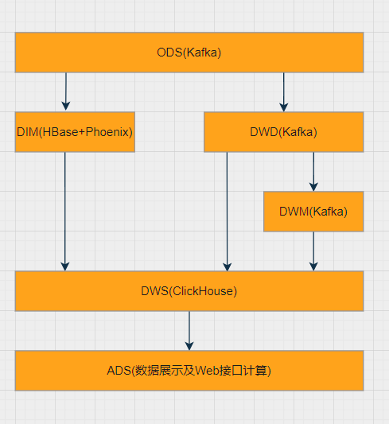

# Project Architecture


Real-time Core: Flink  
Offline Core: Spark  

```properties
Real-time Data Warehouse Layers:
    Computing Framework: Flink; Storage Framework: Message Queue (real-time read & write)
    ODS: Kafka
        Use Case: Read and process each incoming piece of data
    DIM: HBase
        Use Case: Retrieve a single row of dimension table data by primary key
                  (1. Permanent storage, 2. Query by primary key)
        Kafka: Not suitable for long-term storage; cannot handle long-term storage of important user information, and lacks primary key query functionality ×
        HBase: Handles massive data for permanent storage and fast primary key queries √
        Redis: Suitable for large-scale user data, but as an in-memory database ×
        ClickHouse: Not suitable for concurrency; columnar storage ×
        ES: Automatically indexes all fields by default ×
        Hive (HDFS): Inefficient ×
        MySQL: High stress; use slave databases if necessary √
    DWD: Kafka
        Use Case: Read and group incoming data for aggregation processing
    DWS: ClickHouse
        Use Case: Re-group and re-aggregate incoming data
    ADS: No physical storage; essentially querying ClickHouse using SQL in interface modules
        Use Case: Read final result data for display


# Cluster Configuration

| Component          | Version   | Flink01 (6G+60GB) | Flink02 (4G+60GB) | Flink03 (4G+60GB) |
| ------------------- | --------- | ----------------- | ----------------- | ----------------- |
| Hadoop             | 3.1.3     | √                 | √                 | √                 |
| Zookeeper          | 3.5.7     | √                 | √                 | √                 |
| Kafka              | 3.0.0     | √                 | √                 | √                 |
| Flume              | 1.9.0     | √ (log server)    | √ (log server)    | √ (business server) |
| Maxwell            | 1.29.2    | √                 |                   |                   |
| DataX              | 3.0       |                   | √                 |                   |
| MySQL              | 8.0       |                   | √                 |                   |
| SparkSQL           | 3.3.1     | √                 | √                 | √                 |
| HBase              | 2.3.5     | √                 | √                 | √                 |
| Flink              | 1.13.1    | √                 | √                 | √                 |
| ClickHouse         | 20.4.5.36 |                   | √                 |                   |
| Redis              | 7.0.0     | √                 |                   |                   |
| DolphinScheduler   | 2.0.7     | √                 | √                 | √                 |

# Development Tools

| Tool                            | Version   | Purpose                                      |
| ------------------------------- | --------- | -------------------------------------------- |
| IntelliJ IDEA (Ultimate Edition)| 2022.2.3  | Project code writing and management          |
| OffsetExplorer                  | 2.3       | Kafka visualization for Windows              |
| DBeaver Enterprise              | 21.3.0    | Database visualization, supports Redis, MongoDB, etc. |
| VMware 16 Pro                   | 16.1.0    | Creating virtual machine servers             |
| MobaXterm                       | 22.1      | Visualized terminal for virtual machines     |

# Data Warehouse Layers



| Layer | Data Flow                                                  | Tool                               | Storage Medium |
| ----- | ---------------------------------------------------------- | ---------------------------------- | -------------- |
| ODS   | Raw data, including logs and business data                 | Log servers, FlinkCDC/Maxwell/Canal | Kafka          |
| DWD   | Split data into units based on objects, such as orders, page views, etc. | Flink                              | Kafka          |
| DWM   | Further process data objects, e.g., independent visits, bounce behavior (still detailed data) | Flink                              | Kafka          |
| DIM   | Dimension data                                             | Flink                              | HBase          |
| DWS   | Light aggregation of multiple facts into a wide table based on a dimensional theme | Flink                              | ClickHouse     |
| ADS   | Aggregate and filter ClickHouse data as needed for visualization | ClickHouseSQL                      | Visualization BI tools |

# Cluster Scripts

| Script Name                        | Function                                        |
| ---------------------------------- | ---------------------------------------------- |
| xcall.sh (Flink01)                 | View cluster processes                         |
| xsync (Flink01)                    | Distribute files across the cluster            |
| hdp.sh (Flink01)                   | Start Hadoop and Yarn                          |
| zk.sh (Flink01)                    | Start Zookeeper                                |
| kfk.sh (Flink01)                   | Start Kafka                                    |
| mxw.sh (Flink01)                   | Start Maxwell                                  |
| app_log.sh (Flink01)               | Simulate user behavior logs                    |
| db_log.sh (Flink01)                | Simulate business interaction logs             |
| flume_applog_kafka.sh (Flink01)    | Use Flume to collect user behavior logs into Kafka |
| flume_dblog_hdfs.sh (Flink01)      | Use Flume to consume Kafka business logs into HDFS |
| flume_applog_hdfs.sh (Flink01)     | Use Flume to consume Kafka user behavior logs into HDFS |
| gen_import_config.py (Flink02)     | Generate DataX extraction configuration files  |
| gen_import_config.sh (Flink02)     | Batch generate DataX extraction config files for tables |
| mysql_to_hdfs_full.sh (Flink02)    | Bulk import MySQL full business table data into HDFS |
| mysql_to_kafka_inc_init.sh (Flink01)| Initialize MySQL incremental data (full import once) |
| sparksql.sh (Flink01)              | Start SparkSQL; connect with JDBC for offline analysis |
